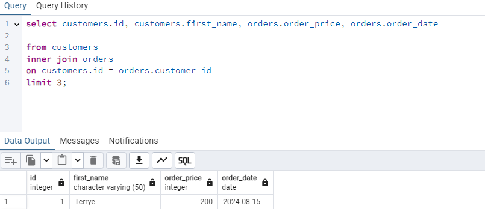
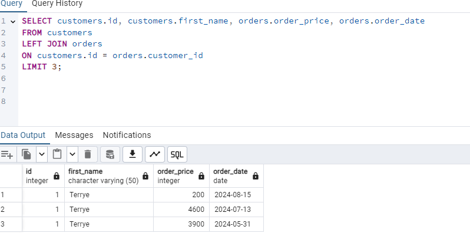
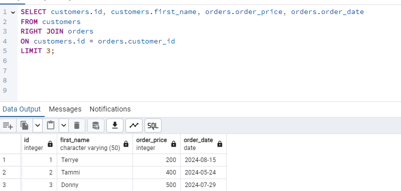
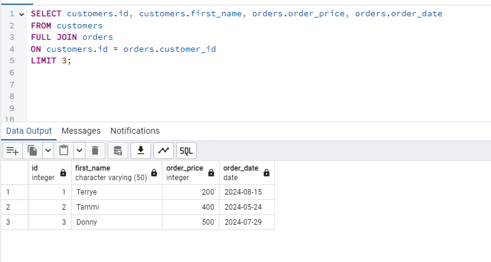

# INNER JOIN

 An INNER JOIN is a type of join that returns only the rows where there is a match in both tables. This means it combines records from two tables where the join condition is met. If there is no match between the two tables, the rows are not included in the result set.

  here is a syntax of inner join: 

 

# LEFT JOIN
LEFT JOIN includes all records from the customers table, and if there’s a matching record in orders, it displays that information. If no matching record exists in orders, it will display NULL for orders columns.

here is a syntax of left join:

RIGHT JOIN
RIGHT JOIN includes all records from the orders table and only matches those records with the customers table where a matching customer_id exists. If no matching record is found in customers, the result will show NULL for the customers columns.

here is a syntax of right join:

# FULL JOIN
FULL JOIN retrieves all records from both the customers and orders tables.
If there’s a match between customers.id and orders.customer_id, the corresponding data from both tables will be displayed.
If a customer has no orders, the order columns will be NULL.
If an order exists without a corresponding customer, the customer columns will be NULL.

here is a syntax of full join:

# ACID PROPERTIES
The ACID properties are a set of key principles that guarantee reliable processing of database transactions. These properties ensure that transactions are processed securely and maintain data integrity, even in cases of failures like power outages or errors

## 1. Atomicity
 A transaction is treated as a single unit, which either fully completes or fully fails. If any part of the transaction fails, the entire transaction is rolled back.

Example: Imagine a banking system where you are transferring $100 from Account A to Account B. The transaction involves two operations:

Deduct $100 from Account A.
Add $100 to Account B.
If the deduction from Account A is successful but the addition to Account B fails (e.g., due to a network issue), atomicity ensures that the $100 is not deducted from Account A, keeping the transaction as a whole intact.

## 2. Consistency
A transaction brings the database from one valid state to another. The database must always be in a consistent state before and after the transaction.

Example: In a school database, you have a rule that no student can have a negative balance in their tuition fees. If a student tries to register for a course that would result in a negative balance, the transaction should fail, and the database remains consistent (no negative balances).

## 3. Isolation
Transactions are isolated from each other until they are committed. This means that the operations of one transaction do not affect the operations of another transaction.

Example: Two transactions are happening simultaneously:

Transaction 1 is transferring $100 from Account A to Account B.
Transaction 2 is transferring $50 from Account B to Account C.
Isolation ensures that if Transaction 1 is not yet committed, Transaction 2 will not see the updated balance of Account B until Transaction 1 is completed. This prevents scenarios where one transaction can see partial results of another, ensuring data integrity.

## 4. Durability
 Once a transaction is committed, the changes made by that transaction are permanent, even in the event of a system failure.

Example: After successfully completing a transaction that updates a customer’s information in a database, the changes must remain in the database, even if there is a power outage or system crash immediately after the commit. The database uses logs and backups to ensure that the committed data is not lost.

# NORMALIZATION
Normalization typically involves organizing data into different levels of "normal forms." Each normal form has specific rules and requirements that must be met. The most commonly used normal forms include:

## First Normal Form (1NF)
 A table is in 1NF if all its columns contain atomic (indivisible) values, and each entry in a column must be of the same data type. It should also have unique column names and no repeating groups or arrays.

Example: A table that lists orders should not have multiple products in a single cell. Instead, each product should be in its own row.

## Second Normal Form (2NF)
 A table is in 2NF if it is in 1NF and all non-key attributes are fully functionally dependent on the primary key. This means there should be no partial dependencies of any column on the primary key.

Example: If a table has a composite primary key (e.g., OrderID and ProductID), all non-key attributes must depend on the entire composite key, not just part of it.

##  Third Normal Form (3NF)
A table is in 3NF if it is in 2NF and all the attributes are directly dependent on the primary key, eliminating transitive dependencies. This means non-key attributes should not depend on other non-key attributes.

Example: In a customer orders table, if the customer’s address is stored, it should not depend on the customer’s name; instead, the address should be in a separate table related by customer ID.

## Boyce-Codd Normal Form (BCNF)
A table is in BCNF if it is in 3NF and every determinant is a candidate key. This means that for every functional dependency (A → B), A should be a superkey.

Example: If a table contains a dependency where a non-key attribute determines another non-key attribute, it violates BCNF. To resolve this, the table may need to be decomposed to ensure that all functional dependencies have candidate keys as their determinants.

##  Fourth Normal Form (4NF)
 A table is in 4NF if it is in BCNF and has no multi-valued dependencies. This means that no attribute should depend on another attribute in a way that allows multiple independent values.
 
Example: If a table lists students and their enrolled courses and hobbies, storing hobbies alongside courses creates multi-valued dependencies. To comply with 4NF, separate tables should be created for courses and hobbies, both linked to the student ID.
